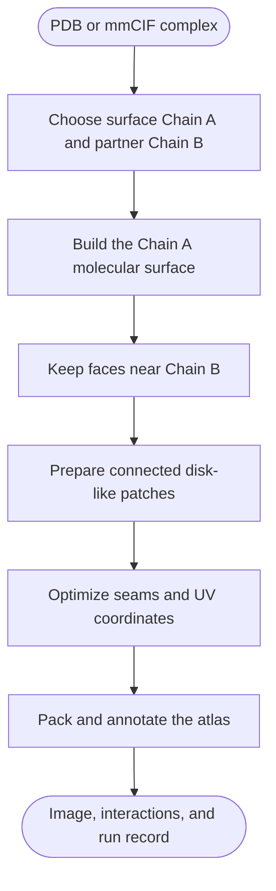

# TopoPPI

<p align="center">
  
</p>

TopoPPI turns a protein complex in PDB or mmCIF format into an annotated two-dimensional map of its interaction surface. The map keeps residue identity, partner contacts, interaction types, chart seams, and run provenance connected to the source structure.

Use the desktop app for an interactive workflow, the `topoppi` command for repeatable single-structure runs, or `topoppi-benchmark` for dataset-scale comparisons.

> **Current release:** [TopoPPI 1.3](https://github.com/GeraltZeroZhong/TopoPPI/releases/tag/v1.3). The application version is 1.3. Benchmark evidence bundles continue to use schema version 2.0.


## Choose a starting point

| Your goal | Start here |
| --- | --- |
| Make a first map on Windows | [Install the Windows app](#windows) and use the **Basic** page |
| Make a first map on a Mac | [Install the macOS app](#macos) and use the **Basic** page |
| Use Linux or automate one structure | [Install with Conda and pip](#linux) and run `topoppi` |
| Call TopoPPI from Python | [Python API](#python-api) |
| Compare methods across a dataset | [Benchmark a dataset](#benchmark-a-dataset) |
| Reproduce a publication study | [Publication workflow tools](https://github.com/GeraltZeroZhong/TopoPPI/blob/v1.3/tools/publication/README.md) |

## Install TopoPPI

### Windows

Download the 64-bit installer from the [v1.3 release](https://github.com/GeraltZeroZhong/TopoPPI/releases/tag/v1.3):

```text
TopoPPI-1.3-windows-x86_64-setup.exe
```

Open the installer and keep its setup window open while it creates the private environment. A fresh installation commonly takes 5–15 minutes and uses GitHub, conda-forge, and PyPI. After setup, open **TopoPPI GUI** from the Start Menu. Routine analysis of local structures can run offline.

The current installer is unsigned, so Windows SmartScreen may ask you to confirm the file. Download it from the project release page, select **More info**, then select **Run anyway**. Upgrade, repair, removal, and local build instructions are in the [Windows guide](https://github.com/GeraltZeroZhong/TopoPPI/blob/v1.3/installer/windows/README.md).

### macOS

Download the disk image that matches the Mac from the [v1.3 release](https://github.com/GeraltZeroZhong/TopoPPI/releases/tag/v1.3):

```text
TopoPPI-1.3-macos-arm64.dmg       Apple Silicon
TopoPPI-1.3-macos-x86_64.dmg      Intel
```

Open the image, drag **TopoPPI** to **Applications**, and try to open it. The v1.3 app is ad-hoc signed and has no Apple notarization. If macOS blocks it, open **System Settings > Privacy & Security**, choose **Open Anyway** for TopoPPI, and confirm **Open**. Older macOS releases may also offer **Open** through the app's Control-click menu. Keep the preparation window open while the bundled runtime expands. Later launches reuse that runtime.

The app includes Python, scientific dependencies, and native OptCuts, and supports macOS 12 or later. Startup recovery, upgrades, removal, and local build instructions are in the [macOS guide](https://github.com/GeraltZeroZhong/TopoPPI/blob/v1.3/installer/macos/README.md).

### Linux

TopoPPI currently targets Python 3.10. Create an environment, install the package, fetch OptCuts, and launch the desktop app:

```bash
conda create -n topoppi -c conda-forge \
  python=3.10 tk igl=2.6.* numpy scipy biopython scikit-image \
  matplotlib trimesh networkx pillow rtree shapely \
  mdanalysis rdkit psutil tqdm meshio pip
conda activate topoppi
python -m pip install "topoppi[all]==1.3"
topoppi-install-optcuts
command -v OptCuts_bin
topoppi-gui
```

The downloadable OptCuts artifact currently covers Linux x86-64. Other Linux architectures can use a locally built executable through `TOPOPPI_OPTCUTS_BIN`.

## Create an interface map

### Desktop app

Launch `topoppi-gui`, or open the installed application on Windows or macOS.

1. On **Basic**, choose a `.pdb`, `.cif`, or `.mmcif` structure.
2. Review the detected protein chains and residue counts.
3. Set **Surface chain** to the protein whose surface you want to map.
4. Set **Partner chain** to the contacting protein. **Swap A/B** maps the opposite surface.
5. Choose the output folder and interaction types.
6. Select **Create Interface Map**.

TopoPPI generates ProLIF annotations when no interaction JSON is supplied. The completed run writes the image, its `.topoppi.json` run record, and the generated `.prolif.json` file to the chosen output folder. Advanced settings expose the surface, topology, UV, OptCuts, labeling, and export controls.

The **Help** menu shows the installed version and opens the user guide or issue tracker. During a run, the status area reports `Load`, `Surface`, `Patch`, `OptCuts`, and `Render` progress.

### Command line

The shortest command is:

```bash
topoppi path/to/complex.pdb \
  --chain-a A \
  --chain-b B \
  --output interface_map.png
```

This creates:

```text
interface_map.png
interface_map.topoppi.json
complex.A-B.prolif.json
```

The generated ProLIF file is placed beside the output image. Supply an existing file with `--prolif interactions.json` when interaction evidence has already been prepared.

For a Linux x86-64 source checkout, this small smoke run uses the included fixture and interaction record:

```bash
topoppi tests/fixtures/tiny_complex.pdb \
  -A A -B B \
  --prolif tests/fixtures/prolif_interactions.json \
  --optcuts-bin tools/OptCuts/OptCuts_bin \
  -o /tmp/topoppi-interface.png
```

Useful defaults and options:

| Option | Default | Purpose |
| --- | ---: | --- |
| `-A`, `--chain-a` | `A` | Surface protein |
| `-B`, `--chain-b` | `B` | Partner used to locate the interface |
| `--cutoff` | `4.0 Å` | Maximum surface-face distance to Chain B |
| `--min-points` | `1` | Minimum interaction residues needed to display a retained patch |
| `--residue-scope` | `interaction` | Annotate interaction residues; `patch` shows the full mapped context |
| `--res` | `1.0 Å` | Surface grid spacing |
| `--max-voxels` | `40,000,000` | Dense-grid allocation budget |
| `--parameterization` | `auto` | Initial UV parameterization |
| `--residue-fragmentation-weight` | `20` | Residue-aware seam objective strength |
| `--optcuts-timeout` | `600 s` | OptCuts budget for each patch |
| `--prolif` | empty | Existing ProLIF JSON |
| `-o`, `--output` | `interface_map.png` | PNG or TIFF image path |

Run `topoppi --help` for every option and `topoppi --version` to check the active installation. Add `--show` when you want the Matplotlib window to remain open after saving.

### Python API

```python
from topoppi.config import TopoPPIRunConfig
from topoppi.pipeline import run_interface_mapping

result = run_interface_mapping(
    TopoPPIRunConfig(
        pdb_file="complex.pdb",
        chain_a="A",
        chain_b="B",
        output_file="results/complex_A-B.png",
    )
)

print(result.output_file)
print(result.manifest_file)
print(result.elapsed_sec)
```

Configuration dataclasses live in [`src/topoppi/config.py`](https://github.com/GeraltZeroZhong/TopoPPI/blob/v1.3/src/topoppi/config.py). The same settings feed the CLI, desktop app, Python pipeline, and benchmark runner.

Python calls require a native OptCuts executable. On Linux x86-64, run `topoppi-install-optcuts`. The [Windows installer](https://github.com/GeraltZeroZhong/TopoPPI/blob/v1.3/installer/windows/README.md) configures the bundled Windows executable, while standalone Windows environments can run `topoppi-install-optcuts --platform windows-x86_64`. On macOS, follow the [native build instructions](https://github.com/GeraltZeroZhong/TopoPPI/blob/v1.3/installer/macos/README.md#build-locally). Set `TOPOPPI_OPTCUTS_BIN` to the resulting executable when it is outside the active environment's command path.

## Understand the result



### Read the map

- Each island is a connected piece of the selected Chain A interface surface.
- The mesh shows the flattened surface geometry. Island boundaries include natural patch boundaries and optimization seams.
- Residue markers belong to Chain A. Their labels can also show paired Chain B residues.
- Marker colors encode the selected interaction classes, such as hydrogen bonds, ionic contacts, pi interactions, hydrophobic contacts, and van der Waals contacts.
- A residue split by a seam can appear on more than one island. TopoPPI places a marker on every connected UV footprint piece.
- Two-dimensional spacing describes the optimized atlas. Use the source structure for physical three-dimensional distance measurements.

The adjacent `.topoppi.json` file records the exact input hash, chains, settings, software environment, OptCuts executable, stage timings, surface diagnostics, topology evidence, display scope, and interaction counts. Keep it with figures used in analysis or publication.

### Mapping details

- TopoPPI reads the first structural model and uses recognized amino-acid heavy atoms from Chain A.
- The molecular surface is a Gaussian-density isosurface extracted with marching cubes.
- Interface faces are selected from their distance to Chain B heavy atoms. GUI, CLI, and Python single-run defaults all use `4.0 Å` in v1.3.
- UV coordinates are stored per face corner, so both sides of a seam keep their own coordinates.
- Multiple retained patches are packed with deterministic transforms and an explicit chart gap.

TopoPPI extends OptCuts with residue-footprint fragmentation energy. For an original footprint component with mass `M` split into pieces with masses `m_k`, the contribution is:

```text
1 - sum((m_k / M)^2)
```

Each residue receives the weight `1 + contact degree`, where contact degree is the number of distinct Chain B partners in the ProLIF records. The standard TopoPPI weight is `20`. A weight of `0` selects the matched geometry-only ablation used in benchmark comparisons. The [benchmark schema](https://github.com/GeraltZeroZhong/TopoPPI/blob/v1.3/docs/benchmark_schema.md#residue-footprint-fragmentation) gives the formal definition and exported evidence.

## Interaction annotations

TopoPPI uses interaction evidence in this order:

1. Read the ProLIF JSON supplied through the CLI, Python configuration, or Advanced desktop page.
2. Generate a chain-pair ProLIF JSON with MDAnalysis, ProLIF, and RDKit.
3. Use geometric interaction assignment when the user enables that diagnostic fallback.

During generation, TopoPPI prepares isolated RDKit copies of the selected chains, adds explicit hydrogens, and runs the ProLIF fingerprint. Source coordinates stay unchanged. Generated metadata binds the records to the structure SHA-256, chain direction, interaction schema, and TopoPPI version.

The display normalizes ProLIF subclasses into `HydrogenBond`, `Ionic`, `PiStacking`, `PiCation`, `Hydrophobic`, `HalogenBond`, `MetalCoordination`, `VdWContact`, and `Other`. PDB insertion codes are retained when they resolve uniquely.

Use `--residue-scope patch` or **Full patch context** to label the surrounding flattened surface. The standard `interaction` scope labels residues supported by the resolved interaction records.

## Benchmark a dataset

`topoppi-benchmark` supports resumable quality studies, uncontended performance measurements, sensitivity plans, and evidence-bundle verification. Start with the small source-tree example to learn the command flow:

```bash
topoppi-benchmark preflight docs/benchmark_quickstart.example.json
topoppi-benchmark run docs/benchmark_quickstart.example.json
topoppi-benchmark verify benchmark_results/quickstart/benchmark_report.json
```

The default terminal output is a concise status summary. Add `--json` for the full structured result, or use `--output-json PATH` on preflight commands to write it directly.

### Choose a benchmark purpose

| Purpose | Measures | Formal run shape |
| --- | --- | --- |
| `quality` | Distortion, flips, seams, fragmentation, retention | One measured repetition, no warm-up |
| `performance` | Wall time, memory, completion, timeouts | At least three repetitions and one warm-up on one worker |

The `comparative` profile evaluates parameterizations and selected OptCuts arms on a shared source-face domain. The `operational_optcuts` profile measures one automatic OptCuts arm as an end-to-end operation.

### Prepare a formal run

Use these tracked files:

- [formal configuration example](https://github.com/GeraltZeroZhong/TopoPPI/blob/v1.3/docs/benchmark_config.example.json)
- [manifest template](https://github.com/GeraltZeroZhong/TopoPPI/blob/v1.3/docs/benchmark_manifest_template.csv)
- [evidence schema and protocol](https://github.com/GeraltZeroZhong/TopoPPI/blob/v1.3/docs/benchmark_schema.md)

Replace the example paths, commit ID, coordinate-audit digest, OptCuts digest, chains, and dataset metadata with frozen study values. A formal run then follows:

```bash
python tools/publication/prepare_manifest_prolif.py \
  --manifest ../topoppi-study/dataset/benchmark_manifest.csv \
  --structure-dir ../topoppi-study/dataset \
  --output-manifest ../topoppi-study/dataset/benchmark_manifest.prolif.csv
```

Keep study inputs and generated evidence outside the source checkout. Use the prepared manifest for the coordinate audit and benchmark configuration. The command generates one chain-bound ProLIF JSON per included structure and fills the required `prolif_file` and `prolif_sha256` columns. The [publication tools guide](https://github.com/GeraltZeroZhong/TopoPPI/blob/v1.3/tools/publication/README.md#bind-prolif-evidence) covers paired cohorts.

```bash
topoppi-benchmark preflight benchmark_config.json \
  --output-json benchmark_preflight.json

topoppi-benchmark run benchmark_config.json \
  --confirm-formal-benchmark

topoppi-benchmark verify \
  benchmark_results/formal_run/benchmark_report.json
```

Formal mode connects the result to an explicit manifest, clean Git commit, OptCuts SHA-256, coordinate audit, input checksums, chain pairs, and interaction declarations. Resume state uses the same configuration fingerprint.

### Run a sensitivity study

The baseline configuration must include `optcuts_automatic`. Create, inspect, and execute a one-factor plan with:

```bash
topoppi-benchmark plan-sensitivity \
  benchmark_config.json \
  docs/sensitivity_axes.example.json \
  --design one_factor \
  --plan-root sensitivity_study

topoppi-benchmark preflight-sensitivity \
  sensitivity_study/sensitivity_plan.json \
  --output-json sensitivity_study/preflight.json

topoppi-benchmark run-sensitivity \
  sensitivity_study/sensitivity_plan.json \
  --confirm-formal-benchmark
```

Supported axes include interface cutoff, grid spacing, Gaussian sigma, isovalue, OptCuts initial lambda, and distortion bound. The [sensitivity section](https://github.com/GeraltZeroZhong/TopoPPI/blob/v1.3/docs/benchmark_schema.md#sensitivity-plans) defines scenario IDs, design rules, and result files.

### Keep the evidence bundle

The main artifacts are:

| Artifact | Contents |
| --- | --- |
| `benchmark_report.json` | Configuration, runtime, per-structure records, metric protocol, and aggregate statistics |
| `benchmark_summary.csv` | One row for each attempted structure |
| `benchmark_manifest.csv` | Accepted and excluded inputs, chains, hashes, and grid estimates |
| `benchmark_failures.csv` | Preprocessing, method, timeout, and resource failures |
| `benchmark_per_patch.csv` | Patch geometry and biological-retention evidence |
| `benchmark_per_face_sample.csv` | Deterministic source-face audit sample |
| `benchmark_per_residue.csv.gz` | Residue fragmentation and seam-crossing evidence |
| `benchmark_provenance.csv.gz` | Final-to-source face, vertex, and atom mappings |
| `benchmark_optcuts_executions.jsonl.gz` | Commands, hashes, settings, and per-patch OptCuts diagnostics |
| `benchmark_artifact_checksums.json` | SHA-256 and byte count for the evidence artifacts |

See the [schema](https://github.com/GeraltZeroZhong/TopoPPI/blob/v1.3/docs/benchmark_schema.md) for every field, comparison domain, missing-value rule, statistical unit, and verification check. Publication cohort preparation and paired analyses are documented in the [publication tools guide](https://github.com/GeraltZeroZhong/TopoPPI/blob/v1.3/tools/publication/README.md).

## Install from a Linux x86-64 source checkout

This procedure uses the Linux x86-64 OptCuts executable tracked in the source tree. Use the [Windows native build guide](https://github.com/GeraltZeroZhong/TopoPPI/blob/v1.3/installer/windows/README.md#build-locally) or [macOS native build guide](https://github.com/GeraltZeroZhong/TopoPPI/blob/v1.3/installer/macos/README.md#build-locally) when developing on those platforms.

```bash
git clone https://github.com/GeraltZeroZhong/TopoPPI.git
cd TopoPPI
conda env create -f environment.yml
conda activate topoppi-dev
python -m pip install -e ".[dev,benchmark,meshio]"
bash tools/OptCuts/install_optcuts.sh
command -v OptCuts_bin
```

The checkout includes a Linux x86-64 OptCuts executable for development. Rebuild the pinned residue-aware source with:

```bash
bash tools/OptCuts/build_residue_aware_optcuts.sh \
  tools/OptCuts/OptCuts_bin
```

The [OptCuts notice](https://github.com/GeraltZeroZhong/TopoPPI/blob/v1.3/tools/OptCuts/NOTICE.md) records the upstream commit, patch behavior, executable SHA-256, platform distribution, and license. The [residue-aware integration guide](https://github.com/GeraltZeroZhong/TopoPPI/blob/v1.3/tools/OptCuts/residue_aware/README.md) documents the sidecar and C++ state engine.

TopoPPI resolves the executable from `TOPOPPI_OPTCUTS_BIN`, the configured path or command name, then the active `PATH`. Point to a local build with:

```bash
export TOPOPPI_OPTCUTS_BIN=/absolute/path/to/OptCuts_bin
```

## Troubleshooting

### OptCuts cannot be found

In a pip or Conda installation:

```bash
conda activate topoppi
topoppi-install-optcuts
command -v OptCuts_bin
```

In a Linux x86-64 source checkout, run `bash tools/OptCuts/install_optcuts.sh`. Use `topoppi-install-optcuts --force` to replace the executable at the selected destination. Windows and macOS users should follow the native OptCuts guidance in the [Python API section](#python-api).

### A chain is missing

TopoPPI reports the available protein chains from the first model. Check capitalization, choose two distinct chains, and use **Swap A/B** when the intended surface is currently the partner. The desktop chain preview also shows residue counts.

### No interface patch is found

Confirm that the file contains the intended biological assembly and chain pair. Compare the partner distance with the `4.0 Å` interface cutoff and increase `--cutoff` gradually for a wider coordinate gap.

### ProLIF generation fails

Check that both chains contain complete protein residues and that the interaction stack imports:

```bash
python -c "import MDAnalysis, prolif, rdkit; print('interaction stack ready')"
```

You can supply a prepared record with `--prolif FILE`. For a distance-based diagnostic, enable `--geometric-interaction-fallback`.

### Surface generation reaches the voxel budget

Single runs can coarsen the grid up to `--max-adaptive-resolution`. Increase `--res`, raise `--max-adaptive-resolution`, or increase `--max-voxels` when memory permits. Formal fixed-resolution studies should record the chosen budget in their configuration and preflight report.

### The desktop app does not start

- Windows startup errors are written to `%LOCALAPPDATA%\TopoPPI\gui-startup.log`; follow the [repair steps](https://github.com/GeraltZeroZhong/TopoPPI/blob/v1.3/installer/windows/README.md#repair-an-installation).
- macOS startup errors are written to `~/Library/Logs/TopoPPI/launcher.log`; follow the [runtime rebuild steps](https://github.com/GeraltZeroZhong/TopoPPI/blob/v1.3/installer/macos/README.md#repair-startup).
- Linux users can start `topoppi-gui` from a terminal to see the active environment and import error.

## Develop, cite, and license

Run the project checks with:

```bash
conda activate topoppi-dev
python -m pytest
python -m ruff check .
```

The complete contribution workflow is in [CONTRIBUTING.md](https://github.com/GeraltZeroZhong/TopoPPI/blob/v1.3/CONTRIBUTING.md). Cite TopoPPI with [CITATION.cff](https://github.com/GeraltZeroZhong/TopoPPI/blob/v1.3/CITATION.cff).

TopoPPI is distributed under the [MIT License](https://github.com/GeraltZeroZhong/TopoPPI/blob/v1.3/LICENSE). OptCuts redistribution details are in the [build and license notice](https://github.com/GeraltZeroZhong/TopoPPI/blob/v1.3/tools/OptCuts/NOTICE.md) and its upstream [`LICENSE.txt`](https://github.com/GeraltZeroZhong/TopoPPI/blob/v1.3/tools/OptCuts/LICENSE.txt).
