# Publication workflow tools

These scripts prepare structure cohorts, freeze benchmark inputs and configurations, and produce paired statistical summaries. Start with the standard [`topoppi-benchmark`](../../README.md#benchmark-a-dataset) workflow, then use the stages needed for the study.

Run every command from the repository root in the `topoppi-dev` environment:

```bash
conda activate topoppi-dev
python tools/publication/<script>.py --help
```

Each stage writes new files to an explicit output path. Keep study data outside the source checkout; the examples use `../topoppi-study`. Archive the source structures, frozen manifests, coordinate audit, configurations, result directories, and analysis summaries together.

## Choose the stage you need

| Stage | Script | Result |
| --- | --- | --- |
| Read PDBbind 2020R1 | `prepare_pdbbind_r1.py` | Traceable dominant chain-pair table |
| Freeze clustered splits | `cluster_pdbbind_manifest.py` | Sequence-clustered development and test manifests |
| Select a compact cohort | `select_benchmark_subset.py` | Deterministic size-stratified, cluster-diverse subset |
| Materialize exact inputs | `stage_manifest_inputs.py` | Checksum-verified structure directory |
| Bind interaction evidence | `prepare_manifest_prolif.py` | ProLIF JSON files and a run-ready manifest |
| Match AlphaFold DB dimers | `match_afdb_complexes.py` | Candidate matches with query provenance |
| Download matched dimers | `download_afdb_matches.py` | Cropped predicted complexes and manifest |
| Build monomer replacements | `build_afdb_monomer_replacements.py` | AFDB monomers aligned into the experimental docking pose |
| Audit experimental/predicted pairs | `audit_paired_structures.py` | Interface eligibility and geometry quality-control records |
| Freeze paired strata | `stratify_afdb_paired_geometry.py` | Reconciled manifests with shared dependency groups and geometry strata |
| Audit all coordinates | `audit_manifest_coordinates.py` | Coordinate audit consumed by formal configurations |
| Prepare weight study | `prepare_residue_aware_optcuts_weight_study.py` | Development-only weight configurations and protocol |
| Select objective weight | `select_residue_aware_optcuts_weight.py` | Frozen selection record from completed development runs |
| Prepare formal runs | `prepare_formal_benchmarks.py` | Quality, performance, and sensitivity configurations |
| Analyze paired reports | `analyze_paired_benchmarks.py` | Experimental/predicted paired inference summary |

## Recommended sequence

```mermaid
flowchart LR
    accTitle: Publication benchmark preparation sequence
    accDescr: Experimental structures are selected and split, predicted counterparts are prepared and audited, configurations are frozen, benchmarks are run, and paired results are analyzed.

    cohort["Select and cluster structures"] --> stage["Stage checksum-verified inputs"]
    stage --> predicted["Prepare predicted counterparts"]
    predicted --> audit["Audit pairs and freeze final manifests"]
    audit --> prolif["Generate and bind ProLIF evidence"]
    prolif --> weight["Audit coordinates and select the development weight"]
    weight --> freeze["Freeze formal benchmark configurations"]
    freeze --> run["Run and verify evidence bundles"]
    run --> analyze["Analyze paired reports"]
```



1. Build the experimental cohort with `prepare_pdbbind_r1.py`, then cluster and split it with `cluster_pdbbind_manifest.py`.
2. Use `select_benchmark_subset.py` when the study specifies a smaller deterministic cohort. Materialize the selected inputs with `stage_manifest_inputs.py`.
3. Prepare predicted counterparts. The dimer route uses `match_afdb_complexes.py` followed by `download_afdb_matches.py`; the monomer route uses `build_afdb_monomer_replacements.py`.
4. Run `audit_paired_structures.py` and reconcile paired strata with `stratify_afdb_paired_geometry.py`.
5. Run `prepare_manifest_prolif.py` for every final experimental and predicted manifest. Use the prepared manifests when creating the shared coordinate audit with `audit_manifest_coordinates.py`.
6. Prepare development-only weight runs, execute them with `topoppi-benchmark`, and freeze the selected value with `select_residue_aware_optcuts_weight.py`.
7. Create the formal configurations with `prepare_formal_benchmarks.py`. Run and verify each evidence bundle with the commands documented in the [benchmark guide](../../README.md#benchmark-a-dataset).
8. Combine exact paired reports with `analyze_paired_benchmarks.py`.

### Bind ProLIF evidence

Formal comparative and residue-aware runs use one ProLIF record per included structure. Generate the records after the cohort, chain direction and file locations are final:

```bash
python tools/publication/prepare_manifest_prolif.py \
  --manifest ../topoppi-study/staged/benchmark_manifest.csv \
  --structure-dir ../topoppi-study/staged \
  --output-manifest ../topoppi-study/staged/benchmark_manifest.prolif.csv
```

The command writes JSON files under `../topoppi-study/staged/prolif/` and fills `prolif_file` and `prolif_sha256` in the output manifest. It also confirms each declared `input_sha256` before generating the interaction record. Repeat the command for each final paired manifest, then pass the prepared manifests to coordinate audit, weight selection, and formal configuration tools.

## Working with manifests

The manifest is the join key across preparation, execution, and analysis. Keep these fields stable after a cohort is frozen:

- `record_id` for row identity;
- structure path and SHA-256 checksum;
- Chain A and Chain B assignments;
- inclusion status and analysis split;
- sequence cluster, family, and predicted-source dependency fields; and
- coordinate-audit metadata required by the chosen profile.

Each included row used by a comparative or residue-aware formal run also carries `prolif_file` and `prolif_sha256`. The path is resolved relative to the manifest.

The [benchmark evidence schema](../../docs/benchmark_schema.md) defines the manifest columns, formal-profile requirements, result files, and sensitivity protocol. The [manifest template](../../docs/benchmark_manifest_template.csv) provides a correctly aligned header and example row.

## Re-running a stage

Use a fresh output directory when changing a cohort rule, threshold, source release, or random seed. Record the command beside the generated files. Network-facing scripts support caches so the same source responses can be reused during an interrupted preparation run.
